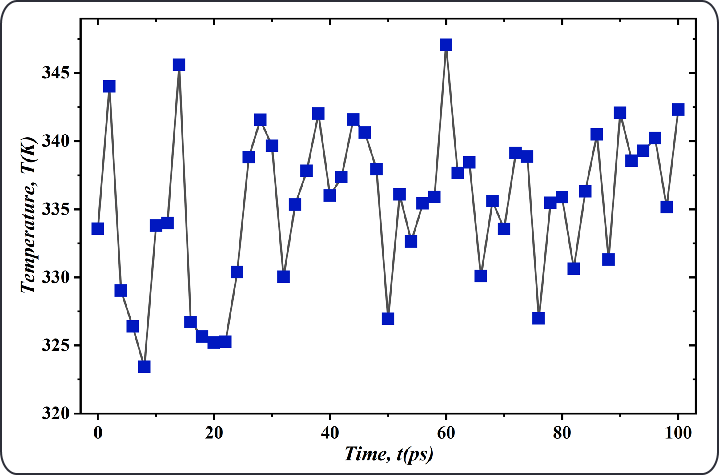
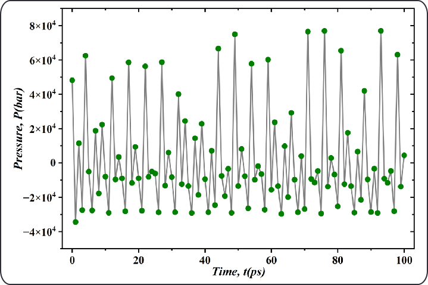
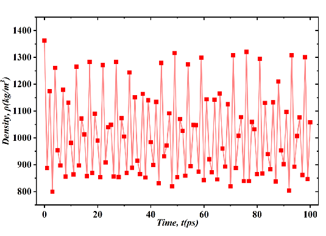
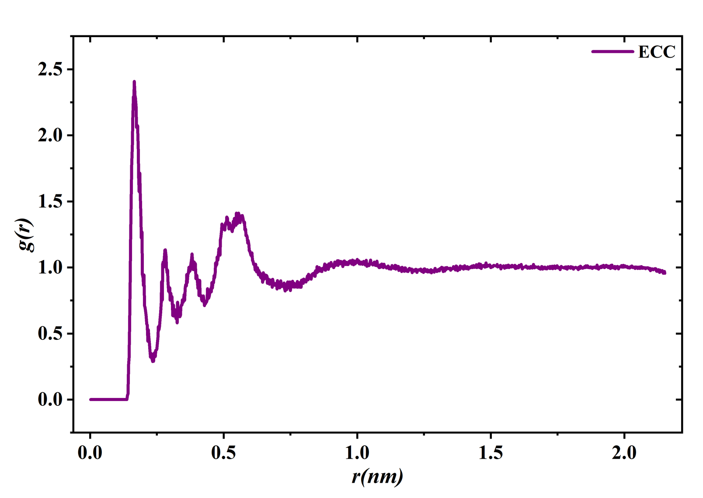
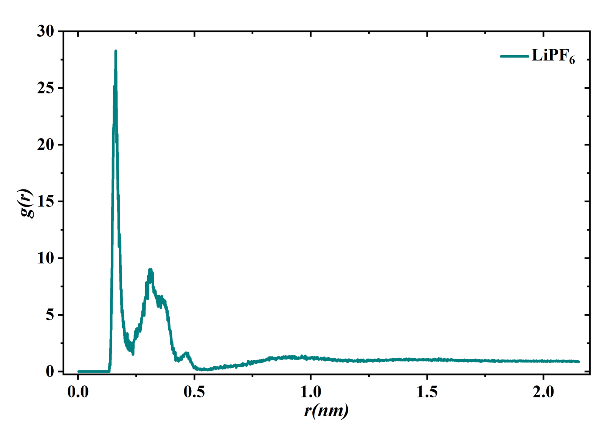

# About

This repository contains a complete molecular dynamics (MD) simulation workflow for a 1 M LiPF₆–Ethylene Carbonate (EC) bulk electrolyte system using GROMACS.  
The study focuses on understanding ion–solvent interactions, solvation structure, and transport properties that are critical for Lithium-ion battery electrolytes.

---

## Project Overview

The electrolyte phase plays a central role in governing lithium-ion transport, ionic conductivity, and interfacial stability in Li-ion batteries.  
In this work, an all-atom OPLS-AA force field was employed to model the behavior of Li⁺ and PF₆⁻ ions solvated in EC. The simulation framework includes system construction, energy minimization, equilibration (NVT and NPT), production MD, and post-processing analysis.

The results provide insight into:
- Structural organization within the bulk electrolyte  
- Solvation structure around Li⁺ ions  
- Ion-pair interactions  
- Transport phenomena, including diffusion  

---

## Repository Structure
├── Molecular Stimulation Flow Diagram/
│ └── WorkFlow.png
├── Results/
│ ├── LiPF6_EC_Density_Profile.png
│ ├── LiPF6_EC_Dipole_Moment.png
│ ├── Lithium ion_Mean_Square_Displacement.png
│ ├── NPT_Equilibration.png
│ ├── NVT_Equilibration.png
│ ├── Radial_Distribution_Function_EC.png
│ └── Radial_Distribution_Function_LiPF6.png
├── input_files/
├── mdp_files/
├── scripts/
└── README.md

---

## Workflow Description

### 1. System Preparation
- Construction of a 4 × 4 × 4 nm³ cubic simulation box.  
- Solvation with Ethylene Carbonate molecules.  
- Addition of 38 Li⁺ and 38 PF₆⁻ ions to achieve a 1 M concentration.  
- Assignment of OPLS-AA/L all-atom force field parameters.

### 2. Energy Minimization
The system is relaxed to eliminate steric clashes and achieve a physically meaningful starting configuration.

### 3. Equilibration
- **NVT ensemble**: Temperature stabilization at 300 K.  
- **NPT ensemble**: Pressure and density stabilization at 1 bar.  
Both steps ensure proper thermal and volumetric equilibration prior to production MD.

### 4. Production Molecular Dynamics
A long-timescale MD run is conducted to generate trajectories for structural and dynamic analysis.

### 5. Post-processing and Analysis
Computed properties include:
- Density evolution  
- Dipole moment fluctuations  
- Radial Distribution Functions (RDFs)  
- Mean Square Displacement (MSD)  

---

## Results

### NVT Equilibration

### NPT Equilibration

### Density Profile

The simulated density stabilizes between 1.0–1.2 g/cm³, which is consistent with the experimental density of ethylene carbonate (~1.3 g/cm³), indicating correct solvent packing.

### Dipole Moment

Dipole moment convergence is observed after approximately 500 ps, confirming structural equilibration.

### Radial Distribution Functions (RDFs)

#### EC–EC Structural Ordering

#### Li⁺ Coordination and Ion-Pair Behavior

The RDF analysis reveals:
- A pronounced Li⁺–O(EC) peak at 0.2–0.3 nm, reflecting strong solvation shell formation.  
- Secondary peaks indicating weaker Li⁺–PF₆⁻ ion pairing.  
- Liquid-like ordering of EC molecules visible through damped oscillations.

### Mean Square Displacement (MSD)

The MSD profile is used to compute the self-diffusion coefficient of Li⁺ ions within the EC medium.

---

## Scientific Conclusion

The molecular dynamics simulation successfully captures the structural and dynamic characteristics of a 1 M LiPF₆–EC electrolyte.  
Key findings include:
- Stable thermodynamic behavior after equilibration.  
- Accurate reproduction of solvent density.  
- Strong Li⁺–EC solvation and moderate Li⁺–PF₆⁻ interactions.  
- Diffusive motion consistent with liquid-phase transport.

These results provide valuable insight into electrolyte behavior relevant to Li-ion battery performance and can serve as a foundation for future studies on alternative solvents, additives, or salt chemistries.

---

## Author Contribution

- Developed the complete MD simulation workflow using GROMACS on Linux.  
- Performed NVT and NPT equilibration and production MD simulations.  
- Constructed the molecular system and initialized force fields.  
- Computed and analyzed RDFs, dipole moment, density evolution, ion-pair behavior, and MSD.  
- Gained experience in molecular dynamics, electrolyte modeling, and analysis of transport and structural properties.

---

## Tools and Software

- GROMACS 2024  
- Python (MDAnalysis, NumPy, Matplotlib)  
- Ubuntu Linux  
- OPLS-AA all-atom force field  

---

## Contact

For scientific discussion, collaboration, or clarification, please feel free to reach out.

